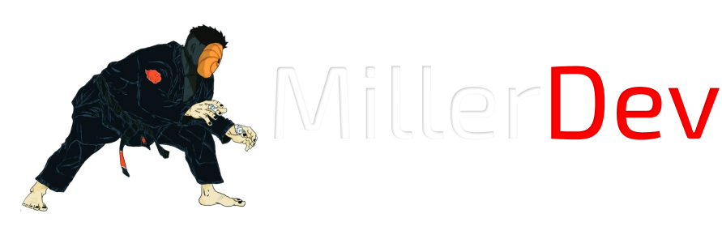

# Hello, I'm Miller
## Welcome to my code repository

### I'm a back-end student, C #/ Java/ JavaScript/ Python. I love programming and am passionate about learning and developing things!

I'm also a game developer with the Unity platform and a Digital Artist.

### My social networks

## My Skills

 
 
 
 

 
 
 
 

## IDEs

 

### Developer

 

Miller M Vasco

